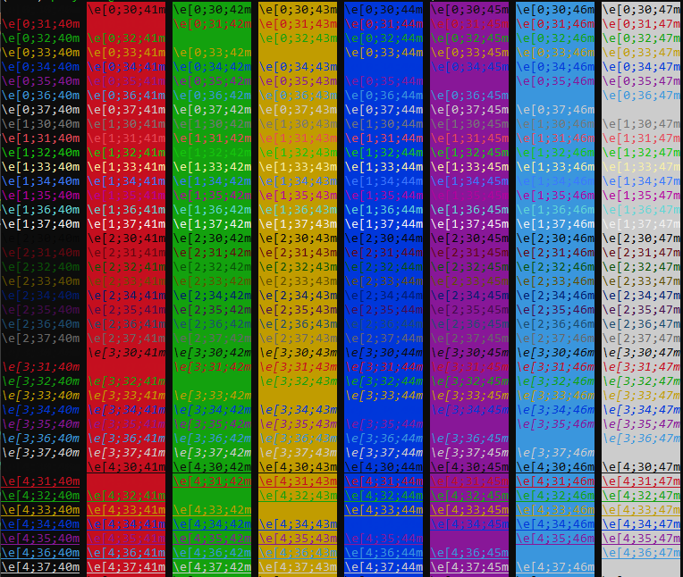

# Coloring Bash Terminal

You can print colored text to terminal using bash color codes. The color code could follow either of the following formats:

- `\e[<FONT>m`
- `\e[<FONT>;<BG>m`
- `\e[<FONT>;<BG>;<FG>m`

, where `FONT`, `BG`, and `FG` are codes for font type, background color and foreground color.
**Note:** _Instead of `\e` you could also use `\033`_

## Font Types

The following codes could be used:

- `0`: Reset to normal
- `1`: Bold text
- `2`: Transparent text
- `3`: Italic text
- `4`: Underline text
- `5`: Flashing text
- `7`: Inverse colors (swap the background and foreground colors)
- `21`: Switch off bold
- `24`: Switch off Underline text
- `27`: Switch off Inverse colors

## Colors

|Color  |Foreground Code | Background Code|
|-----  |:--------------:|:--------------:|
|Black  |30              |40              |
|Red    |31              |41              |
|Green  |32              |42              |
|Yellow |33              |43              |
|Blue   |34              |44              |
|Magenta|35              |45              |
|Cyan   |36              |46              |
|White  |37              |47              |

## Examples

- Bold Red font: `\e[1;30m`
- Blue Background: `\e[0;44m` or `\e[44m`
- Blue Foreground: `\e[0;34m` or `\e[34m`
- No Coloring (Reset to default): `\e[0;34m` or `\e[m`

## Color Matrix

Use the following script to generate a color matrix:

```bash
for x in {0..8}; do 
    for i in {30..37}; do 
        for a in {40..47}; do 
            echo -ne "\e[$x;$i;$a""m\\\e[$x;$i;$a""m\e[m "
        done
        echo
    done
done
echo "" 
```

